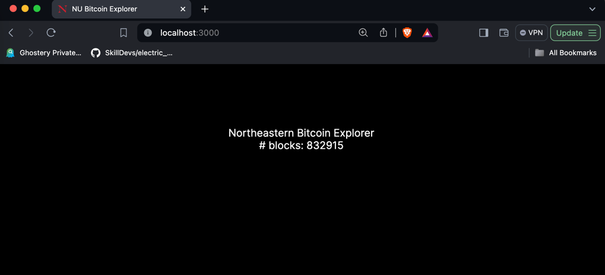

# Bitcoin Explorer

* Install the latest LTS version of Nodejs.
* Clone this repository: `git clone git@github.com:neu-info7500-spring-04/bitcoin-explorer.git`
* Copy the `.env.example` file and name it `.env`. 
* Check that the `GRAPHQL_API` in `.env` points to the API gateway (e.g. Grafbase endpoint).
* In the `bitcoin-explorer` directory, execute:
```
npm install
npm run codegen
npm run dev
```
The app should be visible at http://localhost:3000:


